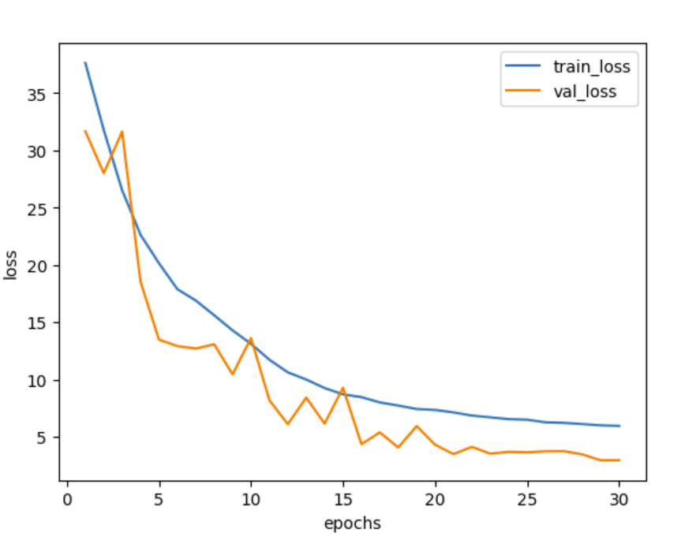

# How I did computer vision on 3000 year old papyrus
## Hello everyone!
If you are interested on the preprocessing of the data, I did another repo called EGYPTO_Preprocessing.

### __Now, for the model:__
Firstly, I made a slight modification to the images before passing them into the model by increasing the brightness and decreasing the contrast by 1.6 and -50, respectively. I preferred to conduct the training in two stages: Knowing that, as a reminder, in my dataset, I have images of characters (named 'characters') and "empty" images (named 'empty'), which are actually images that do not contain any characters. I preferred to train my model to accurately detect characters first, then fine-tune my pre-trained model to detect "empty" images.

Thus, I started with the first object detection, with batch sizes of 16 and 32 for training and testing, respectively. I also created my own model, based on VGG16, but with 10 layers instead of 13 convolutional layers. A max-pooling layer was added at layer 9, and two dropout layers of 0.6 were placed before the two linear layers to prevent overfitting.

To recap:
- Small Network vs. Complex Network:
  - Small Network: A smaller network with fewer layers can better preserve spatial resolution and details, which is useful for detecting small characters. However, it may lack the capacity to learn complex features or may not generalize well on diverse data.
  - Complex Network: A deeper and more complex network can learn more complex patterns and features. However, without proper architectural design, it risks losing small details due to multiple resolution reduction operations. Techniques like using smaller kernels in the early layers, avoiding excessive pooling, or using attention mechanisms can help mitigate this issue.
- Feature Representation:
  - Shallow Layers: The first layers of a deep network capture low-level features like edges and textures, which are essential for character detection.
  - Deep Layers: The deeper layers capture high-level semantic features. For detecting small characters, it is crucial to preserve low-level details while benefiting from high-level feature learning.

That's why I chose 10 layers for my model. Since the characters are quite fine, I didn't want a model that captures every detail of every letter for better generalization, but I still wanted something precise at the character level.

---

The model was trained over 30 epochs, and performance was evaluated at each epoch in terms of accuracy and loss on both the training and validation datasets.

**Methodology:**
- **Model:** A regression model with two loss functions: Smooth L1 Loss (SmoothL1Loss) for regression and negative log-likelihood loss (NllLoss) for classification.
- **Data:** An unspecified dataset used for training and validation.
- **Optimization:** The model was optimized using standard deep learning techniques with weight updates after every batch of 1000 samples.
- **Hyperparameters:** The model was trained with a learning rate of 0.001, a weight decay of 1e-4, and an Adam optimizer.

**Results:**
- **Training Performance:**
  - The training loss decreased from 37.615 to 5.941 over the 30 epochs, indicating a consistent improvement in learning.
  - The training accuracy increased, reaching about 99.27% by the end of the training.
- **Validation Performance:**
  - The validation loss fluctuated but overall decreased, ending at 3.477.
  - The validation accuracy peaked at 99.98% by the end of the training, suggesting that the model generalizes well to unseen data.

**Distance and Loss Analysis:**
- **Distances:** The distances between predictions and actual values varied during training but showed a decreasing trend, consistent with the improvement in loss.
- **Losses:** The combination of Smooth L1 Loss and negative log-likelihood loss effectively captured both regression and classification errors, contributing to the model's robust improvement.

---

It is noted that the accuracy is only calculated for the classification task and not for the bounding box prediction task. An approach using the Jaccard overlap method (also known as the Jaccard coefficient) to measure the similarity between bounding boxes was considered but not implemented. Integrating this method could represent a potential improvement for the model.

Personally, I manually checked the deviation between each point of the bounding boxes. To correctly detect a character, it is essential that the deviation does not exceed about 10 pixels, otherwise, the character may be partially cut off.

Regarding the results of my model, I was pleasantly surprised by its performance. I noticed that some bounding boxes in my dataset were sometimes misaligned or cut off. Despite this, the model managed to ignore these errors and produced precise and well-defined bounding boxes.

As can be seen, the model generates high-quality results with well-defined contours. I did not observe anything alarming in the model outputs.

This process of manual verification and observing the model's performance allowed me to see that, despite some imperfections in the training data, the model is capable of generating robust and accurate predictions, which is promising for future applications.

**Possible Improvement:** Establish the case where the 300x300 image contains multiple characters to detect.

**Fine-tuning the model to predict empty bounding boxes:**
I only saved the parameters of my model, except those related to the fully connected layer (fc1) as the initial output was for 3 classes, and I now want an output of 4 classes. After some research, including seeking help on Stack Overflow because I wasn't sure how to format my bounding boxes to predict an "empty" image, I simply created an additional label in the classes (class n3) and bounding boxes that cover the entire image size.

The goal was to retrain my model over 4 to 5 epochs with a temperature of 0.5 to encourage it to produce accurate results from the start.

The ultimate aim is to propose an API for Egyptologists (ideally developed in Streamlit), where they could input a complete image of papyrus and receive the delimited characters with the names of the scribes who wrote them, provided they supply a database of the scribes.

The program behind the API would resize the image to 3000x3000 pixels, then cut it into 300x300 pixel segments. Once the image is fully segmented, the program would shift the start of the image 2 pixels to the right, then 2 pixels down, etc. The aim is to provide the model with images where the character is whole (or almost) so that it can give an accurate response.

It may not be crucial to have the entire character but rather a large part of it. This would allow the model to have a complete view of a scribe's handwriting, without bias. This approach aims to ensure that the model correctly recognizes characters and associates them with the corresponding scribes, based on a comprehensive analysis of the handwriting traits.

# EGYPTO_model
